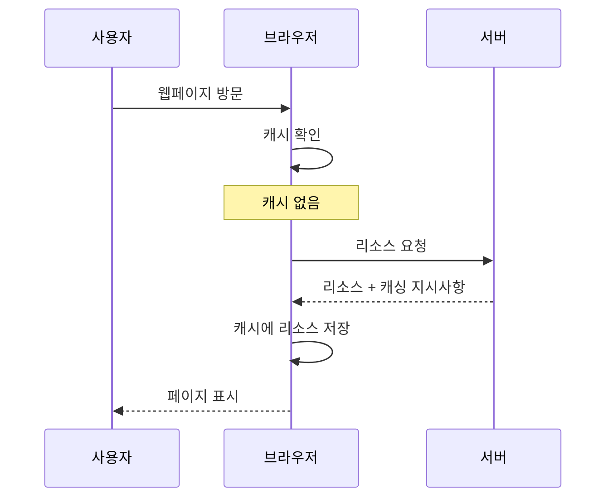
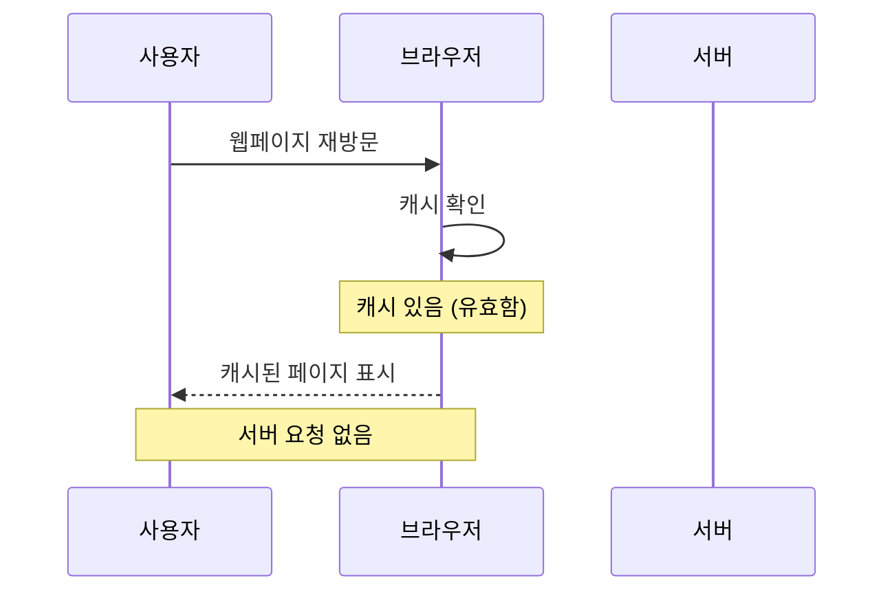
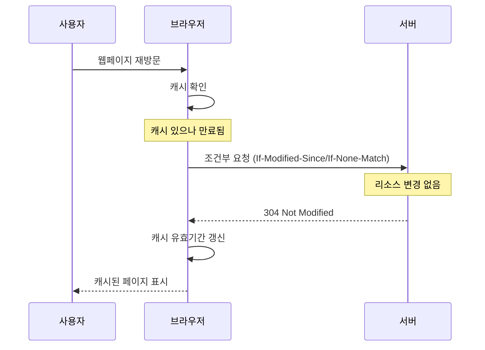
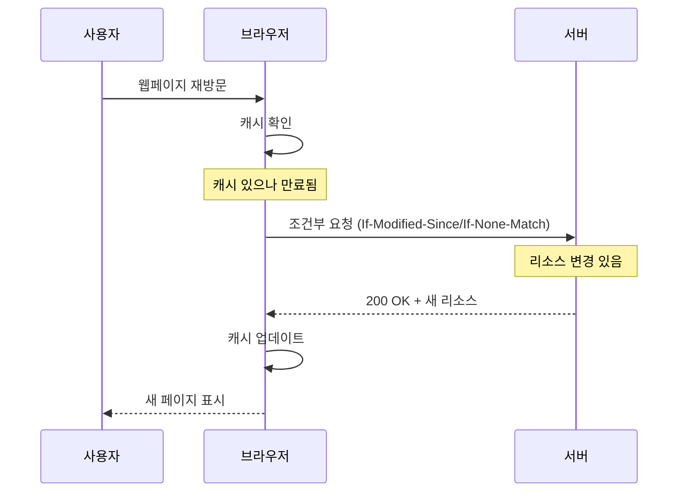

## 💡급하신 분들을 위해서 결론 먼저!

1. 브라우저 캐싱은 브라우저(Chrome, Firefox, Safari, Edge) 마다 이미 자동으로 내재되어있으나, 상황에 맞게 개발자가 설정한 캐싱 규칙이 우선시된다.
2. 브라우저 캐싱은 웹 리소스를 로컬에 저장해 재사용함으로써 웹 성능을 크게 향상시킨다.
3. 브라우저 캐싱은 요청-응답-저장-검증의 기본 프로세스를 따른다.
4. 효과적인 캐싱은 페이지 로딩 시간을 최대 80%까지 단축할 수 있다.
5. 메모리 캐시, 디스크 캐시, HTTP 캐시 등 다양한 캐시 유형이 존재한다.
6. 결국엔 브라우저 또한 하나의 소프트웨어다보니까, 하드웨어의 자원을 쓰는데 이를 더 효율적으로 쓰는 것의 차이점이다.

---

안녕하세요, 오늘은 웹 개발자라면 반드시 알아야 할 **브라우저 캐싱**에 대해 이야기해보려 합니다. 여러분은 웹사이트를 방문할 때 페이지가 순식간에 로드되는 경험을 해보셨나요? 아니면 반대로 느릿느릿 로딩되는 사이트에 짜증을 느껴본 적이 있으신가요? 이 차이의 핵심에는 종종 '캐싱'이라는 마법 같은 기술이 있습니다.

> "(👨🏻‍🏫 : 그런데 보통은 캐싱에 의해서 그렇다~ 정도만 알고 있지, 이게 백엔드가 하는 건지, 프론트가 하는 건지, 브라우저 개발자가 해주는 건지, 어떻게 설정하는지 등에 대해서는 매번 헷갈립니다. 또한 React Query 같은 툴을 쓸 때도 캐싱을 통해 최적화를 쓴다는데, 이 캐싱은 브라우저에서 하는 건지가 매번 걸리게 됩니다. 따라서 이 글을 적게 되었어요! )"

## 캐시 기능은 브라우저 내에 이미 내재되어있다.

브라우저는 특별한 캐싱 헤더가 없더라도 자체적인 "휴리스틱 신선도(heuristic freshness)" 알고리즘을 사용하여 리소스를 자동으로 캐시합니다. 이 방식은 다음과 같이 작동합니다:

- 대부분의 브라우저는 **`Last-Modified`** 헤더를 기반으로 캐시 기간을 추측합니다
- 일반적으로 리소스가 마지막으로 수정된 이후 시간의 약 10%를 캐시 유효 기간으로 설정합니다.
- 예를 들어, 리소스가 20시간 전에 마지막으로 수정되었다면, 브라우저는 약 2시간 동안 해당 리소스를 캐시할 수 있습니다.

그러나 이 자동 캐싱에는 몇 가지 중요한 제한 사항이 있습니다:

- 각 브라우저마다 구현 방식이 일부 다르기 때문에 예측하기 어렵습니다.
- 캐싱 동작이 브라우저와 기기에 따라 일관되지 않을 수 있습니다.
- 웹사이트의 성능과 사용자 경험을 최적화하기에는 충분하지 않을 수 있습니다

> "(👨🏻‍🏫 : 결론적으로, 브라우저는 기본적인 자동 캐싱을 제공하지만, 최적의 성능과 일관된 사용자 경험을 위해서는 개발자가 명시적인 캐싱 규칙을 설정하는 것이 중요합니다. 오늘은 이를 전반적으로 알아보고 어떻게 설정할 수 있는지를 알아보겠습니다. )"

---

## 1. 브라우저 캐싱이란? 웹 성능 향상을 위한 첫걸음

브라우저 캐싱은 웹 브라우저가 웹사이트의 리소스(HTML, CSS, JavaScript, 이미지 등)를 **사용자의 로컬 장치에 임시로 저장하는 프로세스**다. **이렇게 저장된 리소스는 사용자가 같은 웹사이트를 다시 방문하거나 같은 페이지 내에서 이동할 때 서버에서 다시 다운로드하지 않고 로컬에서 불러올 수 있다.**

### 캐싱의 기본 개념

**캐싱**은 컴퓨터 공학에서 자주 사용되는 개념으로, 자주 접근하는 데이터를 빠르게 접근할 수 있는 위치에 임시 저장하는 기술이다. 웹 브라우징에서는 이 개념이 네트워크 요청을 줄이고 페이지 로딩 속도를 향상시키는 데 적용된다.

### 캐싱이 필요한 이유

1. **속도 향상**: 캐시된 리소스는 네트워크를 통해 다시 다운로드할 필요가 없어 페이지 로딩 시간이 크게 단축된다.
2. **대역폭 절약**: 서버와 클라이언트 간의 데이터 전송량이 감소하여 대역폭 사용이 줄어든다.
3. **서버 부하 감소**: 모든 사용자가 매번 모든 리소스를 요청하지 않으므로 서버의 부하가 줄어든다.
4. **오프라인 경험**: 일부 캐싱 전략을 사용하면 인터넷 연결 없이도 웹사이트를 볼 수 있다. (HTML, CSS, JS) 를 브라우저가 갖고 있다면 뼈대(HTML), 뼈대를 꾸며주는 것(CSS) 작동되게 도와주는 코드(JS) 모두가 있으니 백엔드 단과 소통하여 랜더링하는 페이지가 아니면 이 또한 가능하게 된다.

### 캐싱의 간단한 예시 ( 백엔드 개발 영역 )

다음은 HTTP 헤더를 사용한 기본적인 캐싱 설정의 예시다:

```
Cache-Control: max-age=3600
ETag: "33a64df551425fcc55e4d42a148795d9f25f89d4"
Last-Modified: Wed, 03 Apr 2025 04:30:00 GMT
```

이 헤더는 브라우저에게 해당 리소스를 1시간(3600초) 동안 캐시하도록 지시한다.

출처: [MDN Web Docs - HTTP 캐싱](https://developer.mozilla.org/en-US/docs/Web/HTTP/Caching)

---

## 2. 브라우저 캐싱의 작동 원리와 기본 프로세스 이해하기

브라우저 캐싱은 복잡해 보이지만, 기본적으로 몇 가지 핵심 단계를 따른다. 이 프로세스를 이해하면 캐싱을 효과적으로 구현하고 문제를 해결하는 데 큰 도움이 된다.

### 기본 캐싱 프로세스

1. **요청 단계**: 사용자가 웹페이지를 방문하면 브라우저는 필요한 리소스(HTML, CSS, 이미지 등)를 요청한다.
2. **응답 수신**: 서버는 요청된 리소스와 함께 캐싱 지시사항(HTTP 헤더)을 응답으로 보낸다.
3. **캐시 저장**: 브라우저는 이 리소스를 로컬 캐시에 저장하고, 캐싱 지시사항에 따라 유효 기간을 설정한다.
4. **캐시 검증**: 사용자가 같은 리소스를 다시 요청할 때, 브라우저는 캐시된 버전이 있는지, 그리고 그것이 여전히 유효한지 확인한다.
5. **캐시 사용 또는 재검증**: 캐시가 유효하면 브라우저는 로컬 캐시에서 리소스를 제공한다. 유효하지 않으면 서버에 재검증 요청을 보내거나 새 버전을 다운로드한다.

### HTTP 헤더와 캐싱 제어

**브라우저 캐싱은 주로 HTTP 헤더를 통해 제어된다**. 가장 중요한 헤더들은 다음과 같다:

1. **Cache-Control**: 가장 강력하고 유연한 캐싱 제어 메커니즘이다.

   ```
   Cache-Control: max-age=86400, public
   ```

   이 예시는 리소스를 24시간(86400초) 동안 공개적으로 캐시할 수 있음을 나타낸다.

2. **ETag**: 리소스의 특정 버전을 식별하는 고유한 문자열이다.

   ```
   ETag: "33a64df551425fcc55e4d42a148795d9f25f89d4"
   ```

3. **Last-Modified**: 리소스가 마지막으로 수정된 날짜와 시간을 나타낸다.

   ```
   Last-Modified: Wed, 03 Apr 2025 04:30:00 GMT
   ```

4. **Expires**: 리소스가 만료되는 정확한 시간을 지정한다(Cache-Control이 우선함).

   ```
   Expires: Thu, 04 Apr 2025 04:30:00 GMT
   ```

> "(👨🏻‍🏫 : Cache-Control 헤더는 정말 강력해요! 'no-store'로 설정하면 아예 캐싱을 방지할 수도 있고, 'must-revalidate'로 설정하면 만료된 캐시를 반드시 재검증하도록 할 수도 있답니다. 브라우저가 이를 최우선적으로 확인하는 것이라고 볼 수 있죠. )"

### 브라우저의 캐싱 결정 과정

브라우저가 리소스를 요청할 때 따르는 일반적인 결정 과정은 다음과 같다:

1. 캐시에 리소스가 있는가?
   - 없다면 → 서버에 요청
   - 있다면 → 다음 단계로
2. 캐시된 리소스가 여전히 신선한가(max-age 내인가)?
   - 신선하다면 → 캐시에서 직접 사용
   - 신선하지 않다면 → 다음 단계로
3. 재검증이 필요한가?
   - ETag나 Last-Modified가 있다면 → 조건부 요청으로 서버에 재검증
   - 없다면 → 서버에 새 요청

이 과정을 코드로 표현하면 다음과 같다:

```jsx
// 브라우저의 캐싱 결정 과정을 의사 코드로 표현
function fetchResource(url) {
  const cachedResource = cache.get(url);

  if (!cachedResource) {
    // 캐시에 없음 - 서버에서 가져오기
    return fetchFromServer(url);
  }

  if (isFresh(cachedResource)) {
    // 캐시가 신선함 - 캐시에서 직접 사용
    return cachedResource;
  }

  if (hasValidator(cachedResource)) {
    // 검증자가 있음 - 조건부 요청으로 재검증
    return revalidateWithServer(url, cachedResource);
  }

  // 그 외의 경우 - 새로 요청
  return fetchFromServer(url);
}
```

출처: [Google Developers - HTTP 캐싱](https://developers.google.com/web/fundamentals/performance/optimizing-content-efficiency/http-caching)

### **1. 초기 방문 (캐시 없음)**



### **2. 캐시 있는 재방문 (유효한 캐시)**



### **3. 캐시 만료 후 재방문 (데이터 변경은 없음)**



### **4. 캐시 만료 후 재방문 (데이터 변경 있음)**



---

## 3. 캐시가 웹 페이지 로딩 속도에 미치는 영향과 중요성

캐싱은 웹 성능 최적화의 핵심 요소 중 하나다. 적절한 캐싱 전략은 웹사이트의 로딩 속도를 극적으로 향상시킬 수 있으며, 이는 사용자 경험과 비즈니스 성과에 직접적인 영향을 미친다.

### 로딩 속도 향상의 수치적 증거

캐싱이 웹 페이지 로딩 속도에 미치는 영향은 실제 수치로 확인할 수 있다:

1. **초기 로딩 vs 재방문**: 캐싱이 제대로 구현된 웹사이트는 재방문 시 초기 로딩 대비 50-80% 더 빠르게 로드될 수 있다.
2. **네트워크 요청 감소**: 효과적인 캐싱은 HTTP 요청 수를 최대 90%까지 줄일 수 있다.
3. **대역폭 사용량**: 캐싱은 사용자와 서버 간의 데이터 전송량을 크게 줄여, 모바일 사용자의 데이터 사용량을 절약한다.

다음 차트는 캐싱 전후의 페이지 로딩 시간의 상대적인 비교를 나타냈다:

```
로딩 시간(초)
  │
  │    ████
  │    ████
  │    ████        ████
  │    ████        ████
  │    ████        ████        ████
  │    ████        ████        ████
  │____████________████________████____
      초기 방문     캐시 없는     캐시 있는
                   재방문       재방문

```

### **초기 방문 vs 캐시 없는 재방문**

**초기 방문**은 사용자가 웹사이트를 처음 방문할 때 발생하는 상황으로, 브라우저에 해당 웹사이트의 리소스가 전혀 저장되어 있지 않은 상태입니다. 이때 브라우저는 모든 리소스(HTML, CSS, JavaScript, 이미지 등)를 서버에서 새롭게 다운로드해야 한다. 그러나, 캐시 없는 재방문과, 초기 방문은 같은 상황이 아닌가? → 아니다.

**캐시 없는 재방문**은 사용자가 이전에 방문했던 웹사이트를 다시 방문하지만, 다음과 같은 이유로 캐시를 사용할 수 없는 상황을 의미합니다:

1. 캐시 만료: 캐시된 리소스의 유효 기간(TTL)이 만료되었을 때
2. 캐시 무효화: 서버에서 리소스가 변경되어 캐시가 유효하지 않을 때
3. 캐시 정책: 'no-store'와 같은 캐시 제어 지시자가 설정되어 있어 캐싱이 금지된 경우

이 경우, 브라우저는 서버에 조건부 요청(Conditional request)을 보내 캐시 유효성을 검증하는 과정을 거칩니다. 만약 서버에서 리소스가 변경되었다고 판단하면, 브라우저는 새로운 리소스를 다운로드해야 합니다.

### 비즈니스 영향과 사용자 경험

캐싱이 단순히 기술적인 최적화를 넘어 비즈니스에 미치는 영향은 상당하다:

1. **이탈률 감소**: 구글에 따르면, 페이지 로딩 시간이 1초에서 3초로 늘어나면 이탈률이 32% 증가한다.
2. **전환율 향상**: 아마존은 페이지 로딩 시간이 100ms 감소할 때마다 매출이 1% 증가한다는 사실을 발견했다.
3. **SEO 개선**: 구글은 페이지 속도를 검색 순위 결정 요소로 사용하므로, 캐싱을 통한 속도 향상은 검색 엔진 순위에 긍정적인 영향을 미친다.
4. **사용자 만족도**: 빠른 웹사이트는 사용자 만족도와 신뢰도를 높인다.

### 실제 사례 연구

실제 기업들의 캐싱 최적화 사례를 살펴보자:

1. **Pinterest**: 서비스 워커와 캐싱 전략을 도입한 후 페이지 로드 시간을 40% 단축하고, 사용자 참여도를 60% 증가시켰다.
2. **Financial Times**: 적절한 캐싱 정책을 구현하여 반복 방문자의 페이지 로드 시간을 75% 단축했다.
3. **Walmart**: 페이지 로드 시간이 1초 개선될 때마다 전환율이 2% 증가하는 것을 확인했다.

> "(👨🏻‍🏫 : 제 경험상, 이미지가 많은 웹사이트에서 캐싱을 적용했을 때 가장 극적인 성능 향상을 볼 수 있었어요. 특히 로고나 아이콘 같은 반복적으로 사용되는 이미지는 꼭 캐싱하세요! 핀터레스트도 월마트도 사실 대다수가 이미지로 구성되어있는 페이지다보니까, 이를 개선하는 것이 중요했을 겁니다. )"

### DevTool을 통해 캐시 정도 측정하기

자신의 웹사이트에서 캐싱 효과를 측정하는 방법은 다음과 같다:

1. **Chrome DevTools**: Network 탭에서 'Size' 열을 확인하면 '(from disk cache)' 또는 '(from memory cache)'라는 표시를 볼 수 있다.
2. **Lighthouse**: 구글의 Lighthouse 도구를 사용하여 'Serve static assets with efficient cache policy' 항목을 확인한다.
3. **WebPageTest**: 첫 번째 방문과 반복 방문의 성능 차이를 비교할 수 있다.

```jsx
// 페이지 로딩 성능 측정 예시 코드
window.addEventListener("load", function () {
  // 성능 측정 데이터 수집
  const perfData = window.performance.timing;
  const pageLoadTime = perfData.loadEventEnd - perfData.navigationStart;

  console.log(`페이지 로딩 시간: ${pageLoadTime}ms`);

  // 캐시 상태 확인
  const entries = performance.getEntriesByType("resource");
  const cachedResources = entries.filter((entry) => entry.transferSize === 0);

  console.log(
    `총 리소스: ${entries.length}, 캐시된 리소스: ${cachedResources.length}`
  );
});
```

출처: [Web.dev - Measure performance with the RAIL model](https://web.dev/rail/)

---

## 4. 브라우저 캐시의 종류와 각각의 특징 비교

브라우저 캐싱은 단일 메커니즘이 아니라 여러 유형의 캐시가 함께 작동하는 복합적인 시스템이다. 각 캐시 유형은 고유한 특성과 용도를 가지고 있으며, 이들을 이해하면 더 효과적인 캐싱 전략을 수립할 수 있다.

### 메모리 캐시 (Memory Cache)

**메모리 캐시**는 RAM에 저장되는 임시 캐시다. 가장 빠른 접근 속도를 제공하지만, 브라우저가 닫히면 내용이 사라진다.

특징:

- **속도**: 매우 빠름 (RAM 접근 속도)
- **지속성**: 브라우저 세션 동안만 유지
- **용량**: 제한적 (시스템 메모리에 의존)
- **주요 용도**: 현재 탭에서 자주 사용되는 리소스 (스크립트, 스타일시트, 작은 이미지)

### 디스크 캐시 (Disk Cache)

**디스크 캐시**는 하드 드라이브나 SSD에 저장되는 보다 영구적인 캐시이다. 메모리 캐시보다 느리지만 브라우저를 다시 시작해도 데이터가 유지된다.

특징:

- **속도**: 중간 (디스크 접근 속도)
- **지속성**: 브라우저를 닫은 후에도 유지
- **용량**: 상대적으로 큼 (일반적으로 수백 MB)
- **주요 용도**: 큰 이미지, 비디오, 오디오 파일, 자주 방문하는 웹사이트의 리소스

> "(👨🏻‍🏫 : 위 두가지 캐시는 사실 주로 브라우저 개발자가 결정하는 메커니즘입니다. 각 브라우저마다의 성능이 다른 것이 위의 두가지의 차이점 때문입니다. 브라우저는 자체적인 알고리즘을 통해 어떤 리소스를 메모리에 캐시할지, 어떤 리소스를 디스크에 캐시할지 결정합니다. 일반 개발자 ( Frontend, Backend 개발자 ) 들은 **`public`**, **`private`**, **`max-age`** 등의 지시어를 사용하여 캐싱 방식을 제안할 수 있지만, 메모리 vs 디스크 선택은 직접 제어할 수 없습니다.)"

### HTTP 캐시 (HTTP Cache)

**HTTP 캐시**는 HTTP 헤더를 기반으로 작동하는 캐시 메커니즘으로, 서버가 명시적으로 캐싱 규칙을 지정할 수 있다.

특징:

- **제어**: 서버 측에서 HTTP 헤더를 통해 제어
- **유연성**: 다양한 캐싱 정책 설정 가능
- **검증**: ETag, Last-Modified 등을 통한 리소스 검증 지원
- **주요 용도**: 모든 종류의 웹 리소스에 적용 가능

> "(👨🏻‍🏫 : HTTP 캐시는 개발자가 가장 많이 제어할 수 있는 캐시 유형이에요. Cache-Control 헤더만 잘 설정해도 성능이 확 좋아진답니다!)"

### 서비스 워커 캐시 (Service Worker Cache)

**서비스 워커 캐시**는 프로그래밍 방식으로 완전히 제어할 수 있는 캐시로, 오프라인 경험을 제공하는 데 중요하다.

특징:

- **제어**: JavaScript를 통한 프로그래밍 방식 제어
- **오프라인 지원**: 네트워크 연결 없이도 웹 앱 사용 가능
- **유연성**: 사용자 정의 캐싱 전략 구현 가능
- **주요 용도**: PWA(Progressive Web Apps), 오프라인 기능이 필요한 웹 앱

```jsx
// 서비스 워커를 사용한 캐싱 예시
self.addEventListener("install", function (event) {
  event.waitUntil(
    caches.open("my-cache-v1").then(function (cache) {
      return cache.addAll([
        "/",
        "/styles/main.css",
        "/scripts/main.js",
        "/images/logo.png",
      ]);
    })
  );
});

self.addEventListener("fetch", function (event) {
  event.respondWith(
    caches.match(event.request).then(function (response) {
      return response || fetch(event.request);
    })
  );
});
```

출처: [MDN Web Docs - 서비스 워커 API](https://developer.mozilla.org/en-US/docs/Web/API/Service_Worker_API)

### 브라우저별 캐시 구현 차이

각 브라우저는 캐시를 약간 다르게 구현하므로, 이러한 차이점을 이해하는 것이 중요하다:

| 브라우저 | 메모리 캐시 크기 | 디스크 캐시 기본 크기      | 특이사항                                  |
| -------- | ---------------- | -------------------------- | ----------------------------------------- |
| Chrome   | 동적 할당        | ~80% 사용 가능 디스크 공간 | 각 프로필별 독립 캐시                     |
| Firefox  | 동적 할당        | 기본 1GB, 조정 가능        | 강력한 개인정보 보호 모드                 |
| Safari   | 제한적           | 시스템에 의해 관리         | ITP(Intelligent Tracking Prevention) 적용 |
| Edge     | 동적 할당        | 기본 최대 10GB             | Chromium 기반으로 Chrome과 유사           |

### 최적의 캐시 전략 선택하기

웹사이트의 특성에 따라 다양한 리소스에 적합한 캐시 전략이 다르다:

1. **자주 변경되지 않는 정적 자산** (로고, 아이콘, 폰트):
   - 장기 캐싱 (Cache-Control: max-age=31536000)
   - 버전 관리 또는 지문(fingerprinting) 적용
2. **자주 업데이트되는 CSS/JS**:
   - 중간 기간 캐싱 + 버전 관리
   - 파일명에 해시 포함 (예: main.a2b3c4.js)
3. **API 응답 데이터**:
   - 짧은 기간 캐싱 또는 조건부 요청
   - ETag 활용
4. **사용자별 콘텐츠**:
   - private 캐시 지시문 사용
   - 필요한 경우 no-store 적용

> "(👨🏻‍🏫 : 글을 읽다보면 저는 이 부분에서 갑자기 궁금한 점이 생겼는데 여러분도 한 번 생각해보세요! 브라우저에는 디스크도, 메모리도 없는데 왜 브라우저 캐시라는 이름이 붙었을까요? 결론부터 말씀을 드리자면 브라우저 또한 하나의 소프트웨어이고, 즉 하드웨어에 의해서 돌아갑니다. 그 결과 하드웨어의 자원을 할당받아 사용하는데, 브라우저는 운영체제로부터 할당받은 메모리와 디스크 공간을 사용하여 다양한 캐시를 구현합니다. 브라우저 캐시라는 이름이 붙는 이유는 이러한 캐싱 메커니즘이 웹 브라우저 소프트웨어에 의해 관리되고 구현되기 때문입니다.)"

### 브라우저와 캐시의 관계 명확히 하기

1. **브라우저는 소프트웨어이다**: 웹 브라우저(Chrome, Firefox, Safari 등)는 컴퓨터에서 실행되는 소프트웨어 애플리케이션이다. 이 소프트웨어는 컴퓨터의 하드웨어 자원(메모리, 디스크 등)을 활용한다.
2. **브라우저가 자원을 관리한다**: 브라우저는 운영체제로부터 할당받은 메모리와 디스크 공간을 사용하여 다양한 캐시를 구현한다.
   - **메모리 캐시**: 브라우저는 운영체제로부터 할당받은 RAM의 일부를 사용하여 메모리 캐시를 구현한다.
   - **디스크 캐시**: 브라우저는 하드 드라이브나 SSD의 특정 폴더/디렉토리를 사용하여 디스크 캐시를 구현한다.
3. **브라우저 자체 기능**: HTTP 캐시와 서비스 워커 캐시는 브라우저가 제공하는 기능으로, 브라우저 소프트웨어의 일부이다.

### 브라우저 캐시의 실제 저장 위치

브라우저 캐시의 실제 저장 위치는 다음과 같습니다:

1. **메모리 캐시**: 컴퓨터의 RAM에 저장되지만, 브라우저 프로세스에 할당된 메모리 공간 내에서 관리됩니다.
2. **디스크 캐시**: 운영체제의 파일 시스템에 저장됩니다. 예를 들어:
   - Chrome (Windows): `C:\\Users$$사용자명]\\AppData\\Local\\Google\\Chrome\\User Data\\Default\\Cache`
   - Firefox (Windows): `C:\\Users$$사용자명]\\AppData\\Local\\Mozilla\\Firefox\\Profiles$$프로필]\\cache2`
   - Chrome (Mac): `~/Library/Caches/Google/Chrome`
   - Safari (Mac): `~/Library/Caches/com.apple.Safari`
3. **HTTP 캐시**: 이는 개념적인 메커니즘으로, 실제 저장은 메모리 캐시나 디스크 캐시를 통해 이루어집니다.
4. **서비스 워커 캐시**: Cache API를 통해 구현되며, 일반적으로 브라우저의 디스크 캐시와는 별도의 저장소를 사용합니다.

따라서 "브라우저 캐시"라는 이름은 이러한 캐싱 메커니즘이 웹 브라우저 소프트웨어에 의해 구현되고 관리된다는 사실에서 비롯된 것입니다. 브라우저는 운영체제가 제공하는 하드웨어 자원(메모리, 디스크)을 활용하여 이러한 캐시를 구현합니다.

> "(👨🏻‍🏫 : 어떻게 좀 이해가 됐나요? 글을 세부적으로 여러개로 나눌까 하다가 이해를 위해서 한 번의 글에 담으려고 노력했습니다 ㅎㅎ 좀 길어도 재밌게 읽었기를 바랍니다!)"

> 🙇🏻 글 내에 틀린 점, 오탈자, 비판, 공감 등 모두 적어주셔도 됩니다. 감사합니다..! 🙇🏻

---
