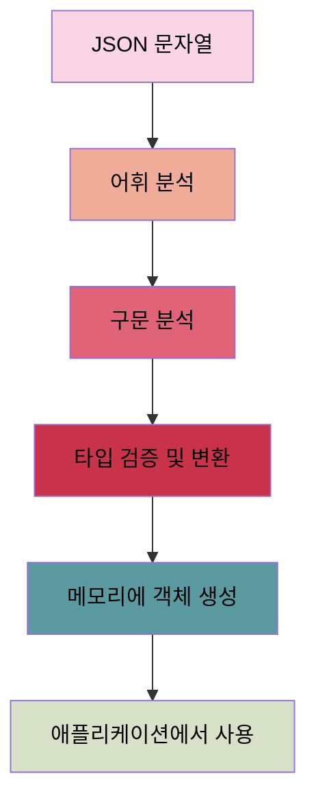
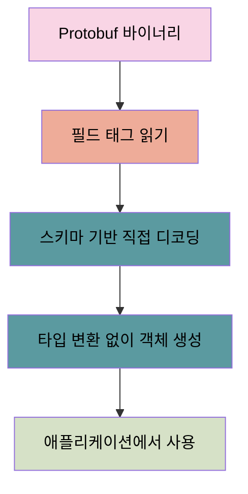

## Protocol Buffers: JSON보다 더 작고, 더 빠르고, 더 단순한 이유

Protobuf는 .proto 파일에 데이터 구조를 정의하고, 이를 컴파일하여 다양한 프로그래밍 언어로 코드를 생성한다. 이렇게 생성된 코드는 데이터를 효율적으로 직렬화하고 역직렬화하는 기능을 제공한다. 그렇다면 왜 Protobuf가 JSON보다 더 작고, 더 빠르고, 더 단순한지 자세히 살펴보자.

## 1. 텍스트 → 바이너리 (Protobuf와 JSON 크기 비교)

Protobuf는 바이너리 형식으로 데이터를 인코딩하여 JSON보다 훨씬 작은 크기의 데이터를 생성합니다. 이 차이를 실제 예시와 함께 살펴보겠습니다.

### 예시 데이터 구조

먼저 간단한 사용자 정보를 담는 데이터 구조를 정의해보겠습니다:

**Protobuf 스키마 (.proto 파일)**:

```protobuf
syntax = "proto3";

message User {
  string name = 1;
  int32 age = 2;
  string email = 3;
}
```

**동일한 JSON 구조**:

```json
{
  "name": "Kyujin",
  "age": 30,
  "email": "kyujin@example.com"
}
```

### 크기 비교 분석

이 데이터가 직렬화되었을 때 어떻게 다른지 살펴보겠습니다:

### JSON 형식

JSON 형식에서는 필드 이름이 매번 반복되고 구문 요소(따옴표, 콜론, 중괄호 등)가 포함됩니다:

```json
{
  "name": "Kyujin",
  "age": 30,
  "email": "kyujin@example.com"
}
```

이 JSON 문자열의 크기는 약 54바이트입니다.

### Protobuf 형식

Protobuf에서는 바이너리 형식으로 인코딩되며, 다음과 같은 최적화가 적용됩니다:

1. **필드 이름 대신 번호 사용**: "name" 대신 필드 번호 1 을 사용
2. **타입 정보 생략**: 스키마에 이미 정의되어 있음
3. **구문 요소 제거**: 따옴표, 콜론, 쉼표 등이 없음

바이너리 형식을 텍스트로 표현하면 다음과 같은 형태가 됩니다:

```json
[필드1(name)] [길이6][Kyujin]
[필드2(age)] [30]
[필드3(email)] [길이18][kyujin@example.com]
```

실제 바이너리 크기는 약 32바이트로, JSON보다 약 40% 작습니다.

> (👨🏻‍🏫 : 즉 모든 데이터마다 중복되는 name, age, email 등을 계속 사용하는 게 아니라, 필드 번호로 사용하고 타입 정보 또한 스키마로 정의한 것을 참조하고, 따옴표, 콜론, 쉼표등 불필요한 구문 요소를 제거하여 성능을 개선하는 겁니다. 보통 저희가 개발을 할 때, 중복되는 것은 매번 따로 빼둬서, 재활용하는데 이를 설계 단계부터 적용했다고 보면 될 것 같습니다.)

### 코드 예시

다음은 Python에서 동일한 데이터를 JSON과 Protobuf로 직렬화하는 예시입니다:

**JSON 직렬화**:

```python
import json

*# JSON 데이터 생성 및 직렬화*
user_json = {
    "name": "Kyujin",
    "age": 30,
    "email": "kyujin@example.com"
}
json_data = json.dumps(user_json)
print(f"JSON 크기: {len(json_data)} 바이트")
print(json_data)
```

**Protobuf 직렬화** (user_pb2.py는 protoc 컴파일러로 생성된 파일):

```python
import user_pb2

*# Protobuf 메시지 생성 및 직렬화*
user_proto = user_pb2.User()
user_proto.name = "Kyujin"
user_proto.age = 30
user_proto.email = "kyujin@example.com"
proto_data = user_proto.SerializeToString()
print(f"Protobuf 크기: {len(proto_data)} 바이트")
```

### 실제 인코딩 방식

Protobuf의 실제 인코딩을 더 자세히 살펴보면:

1. **필드 식별**: 각 필드는 `(필드 번호 << 3) | 와이어 타입`으로 인코딩됩니다.
   - 문자열 필드 "name"(필드 번호 1)은 `0x0A`(10)로 인코딩
   - 정수 필드 "age"(필드 번호 2)는 `0x10`(16)으로 인코딩
2. **가변 길이 인코딩**: 작은 숫자는 적은 바이트로 표현됩니다.
   - 숫자 30은 단 1바이트로 인코딩됨
3. **문자열 인코딩**: 문자열은 길이 접두사와 함께 저장됩니다.
   - "Kyujin"은 길이(6) + 문자열 데이터로 인코딩

이러한 최적화로 인해 데이터가 커질수록 Protobuf와 JSON의 크기 차이는 더 커집니다. 특히 반복되는 구조나 큰 배열에서 Protobuf의 효율성이 더욱 두드러집니다. 벤치마크 결과에 따르면, 작은 메시지의 경우 Protobuf는 gzip으로 압축된 JSON의 16%에 불과한 크기를 가질 수 있습니다.

https://newsletter.systemdesign.one/p/protocol-buffers-vs-json

> (👨🏻‍🏫 : 이러한 크기 최적화는 네트워크 대역폭 절약과 전송 속도 향상으로 이어지는 걸 알 수 있는데요? 제가 애용하는 LinkedIn에서는 Protobuf 도입 후 큰 페이로드에 대한 지연 시간이 60% 감소했다고 합니다!)

## 2. 직렬화/ 역직렬화 개선

### 직렬화/역직렬화 속도

Protobuf는 JSON보다 직렬화와 역직렬화 과정에서 훨씬 뛰어난 성능을 보인다. 최근 벤치마크에 따르면 Protobuf 직렬화는 JSON보다 45배 빠르고, 역직렬화는 무려 165배 빠른 경우도 있다. 이러한 성능 우위는 다음과 같은 요소에서 비롯된다:

1. **정적 타입 시스템**: Protobuf는 컴파일 시점에 타입이 결정되므로, 런타임에 타입을 확인하고 변환하는 오버헤드가 없다.
2. **최적화된 파싱 코드**: Protobuf 컴파일러는 특정 데이터 구조에 최적화된 파싱 코드를 생성한다.
3. **바이너리 형식의 효율성**: 텍스트를 파싱하는 것(JSON 형식)보다 바이너리 데이터를 파싱하는 것이 본질적으로 더 빠르다.

### 부분 파싱의 이점

Protobuf의 또 다른 성능 이점은 전체 메시지를 파싱하지 않고도 특정 필드에 접근할 수 있다는 점이다[4](https://lab.wallarm.com/what/protobuf-vs-json/). 이는 대용량 데이터를 다룰 때 특히 유용하다.

> (👨🏻‍🏫 : 텍스트를 파싱하는 것(JSON 형식)보다 바이너리 데이터를 파싱하는 것이 본질적으로 더 빠르겠죠? )

### JSON 방식



### Protobuf 방식



## 3. 스키마 기반 접근 방식

### 엄격한 타입 안전성

Protobuf는 .proto 파일에 정의된 스키마를 통해 엄격한 타입 안전성을 제공한다. 이는 다음과 같은 이점을 가져온다:

1. **컴파일 시점 오류 검출**: 타입 불일치와 같은 오류를 컴파일 시점에 발견할 수 있어 런타임 오류를 줄인다.
2. **명확한 API 계약**: 스키마가 API 계약 역할을 하여 클라이언트와 서버 간의 통신을 명확히 정의한다.
3. **자동 코드 생성**: 스키마에서 자동으로 생성된 코드는 타입 안전성을 보장하고 개발자의 실수를 줄인다.

### 스키마 진화의 용이성

Protobuf는 스키마 진화를 쉽게 지원한다[3](https://flatirons.com/blog/protobuf-vs-json/). 이는 다음과 같은 방식으로 이루어진다:

1. **하위 호환성**: 새 필드를 추가하거나 기존 필드를 선택적으로 만들어도 기존 코드가 계속 작동한다.
2. **필드 번호 보존**: 한 번 할당된 필드 번호는 변경되지 않으므로 이전 버전과의 호환성이 유지된다.
3. **필드 폐기 지원**: 더 이상 사용하지 않는 필드를 명시적으로 폐기(deprecated)할 수 있다.

## 4. 실제 사용 사례에서의 효율성

### 데이터 크기에 따른 효율성 변화

Protobuf와 JSON의 효율성 차이는 데이터 크기에 따라 달라질 수 있다:

1. **작은 메시지**: 작은 메시지에서는 Protobuf가 JSON보다 훨씬 효율적이다. 필드 이름과 구문 요소의 오버헤드가 상대적으로 크기 때문이다[5](https://nilsmagnus.github.io/post/proto-json-sizes/).
2. **대용량 데이터**: 데이터 크기가 커질수록 상대적인 효율성 차이는 줄어들지만, Protobuf는 여전히 더 작은 크기를 유지한다[5](https://nilsmagnus.github.io/post/proto-json-sizes/).

```go
// 간단한 Protobuf 메시지 정의 예시
syntax = "proto3";

message Person {
  string name = 1;
  int32 id = 2;
  string email = 3;
}
```

이 간단한 예시에서도 JSON으로 표현할 때보다 Protobuf가 더 효율적으로 데이터를 저장하고 전송할 수 있다.

### 고성능 애플리케이션에서의 이점

Protobuf의 성능 이점은 다음과 같은 고성능 애플리케이션에서 특히 두드러진다:

1. **마이크로서비스 통신**: 서비스 간 대량의 메시지 교환이 필요한 마이크로서비스 아키텍처에서 Protobuf의 효율성이 큰 이점을 제공한다.
2. **실시간 데이터 처리**: 데이터를 빠르게 직렬화하고 역직렬화해야 하는 실시간 시스템에서 Protobuf의 성능이 중요하다.
3. **모바일 애플리케이션**: 네트워크 대역폭과 배터리 사용량이 제한된 모바일 환경에서 Protobuf의 작은 메시지 크기가 유리하다.

## 5. 유지보수의 관점에서의 Protobuf와 JSON

Protobuf는 성능과 데이터 크기 측면에서 뛰어난 이점을 제공하지만, 유지보수 관점에서는 JSON에 비해 상당한 도전 과제를 안고 있습니다.

### **Protobuf의 유지보수 문제점**

Protobuf는 본질적으로 중앙 집중형 스키마 관리 방식을 채택하고 있어 여러 유지보수 문제를 야기합니다:

1. **스키마 변경의 복잡성**: Protobuf에서 스키마를 변경하려면 .proto 파일을 수정하고, 모든 관련 코드를 재컴파일해야 합니다. 이는 여러 서비스와 클라이언트가 연결된 대규모 시스템에서 상당히 번거로운 작업이 됩니다.
2. **하위 호환성 관리의 부담**: 필드를 추가하거나 제거할 때 하위 호환성을 유지하기 위해 필드 번호 관리에 각별한 주의가 필요합니다. 한 번 사용된 필드 번호는 재사용할 수 없기 때문에, 장기 프로젝트에서는 필드 번호 관리가 복잡해질 수 있습니다. 이에 따른 여러 트레이드 오프나, 전략이 발생하게 됩니다.
3. **배포 조정의 어려움**: 스키마 변경 시 모든 관련 서비스를 동시에 업데이트하는 것이 이상적이지만, 현실적으로는 점진적 배포가 필요합니다. 이 과정에서 버전 불일치 문제가 발생할 수 있습니다.
4. **개발 환경 설정의 복잡성**: 새로운 개발자가 프로젝트에 합류할 때 Protobuf 컴파일러 설정, 코드 생성 파이프라인 구성 등 추가적인 학습 곡선이 존재합니다.

### **JSON의 유지보수 이점**

반면 JSON은 유연한 스키마 특성으로 인해 유지보수가 상대적으로 용이합니다:

1. **스키마 변경의 유연성**: JSON은 스키마 정의가 필수적이지 않으며, 필요에 따라 필드를 쉽게 추가하거나 제거할 수 있습니다. 이는 빠른 프로토타이핑과 반복 개발에 적합합니다.
2. **배포 독립성**: 서비스 간 JSON 구조 변경은 상대적으로 독립적으로 이루어질 수 있으며, 컴파일 단계가 필요 없습니다.
3. **낮은 진입 장벽**: 대부분의 개발자가 이미 JSON에 익숙하므로 새로운 팀원의 온보딩이 쉽습니다.

### **실제 사례**

대규모 시스템에서 Protobuf 스키마 변경은 상당한 조정이 필요합니다. 예를 들어, 한 기업에서는 핵심 데이터 모델의 Protobuf 스키마 변경 시 50개 이상의 마이크로서비스를 동시에 업데이트해야 했고, 이 과정에서 예상치 못한 호환성 문제로 배포가 지연되었습니다.

### **균형 잡힌 접근법**

많은 조직에서는 이러한 도전 과제를 해결하기 위해 다음과 같은 전략을 채택합니다:

- **점진적 변경**: 필드 추가 시 항상 선택적(optional) 필드로 설정
- **버전 관리 전략**: 메이저 변경 시 새로운 서비스 엔드포인트 생성
- **하이브리드 접근법**: 성능이 중요한 내부 통신에는 Protobuf, 외부 API에는 JSON 사용

유지보수 관점에서는 프로젝트의 규모, 팀의 경험, 변경 빈도 등을 고려하여 Protobuf와 JSON 중 적절한 선택을 해야 합니다. 작은 팀이나 빠른 변화가 필요한 프로젝트에서는 JSON이 유지보수 측면에서 더 실용적일 수 있습니다.

## 6. 선택의 기준: Protobuf vs JSON

### 각 형식의 적합한 사용 사례

Protobuf와 JSON은 각각 다른 상황에 적합하다:

1. **Protobuf 적합 사례**:
   - 내부 시스템 간 통신 (MSA에 적합한 이유)
   - 고성능이 요구되는 애플리케이션
   - 대량의 데이터 처리가 필요한 경우
   - 엄격한 타입 안전성이 중요한 경우
2. **JSON 적합 사례**:
   - 웹 기반 애플리케이션
   - 공개 API
   - 사람이 읽고 디버깅해야 하는 경우
   - 개발 용이성이 중요한 경우
   - 유지 보수의 주기가 짧을 경우

### 실용적인 접근 방식

실제 프로젝트에서는 두 형식을 상황에 맞게 혼합하여 사용하는 것이 가장 실용적인 접근 방식일 수 있다. 내부 시스템 통신에는 Protobuf를 사용하고, 외부 API에는 JSON을 제공하는 방식으로 각 형식의 장점을 최대한 활용할 수 있다.

> (👨🏻‍🏫 : 결국 모든 기술 선택은 트레이드오프예요! Protobuf의 성능과 효율성이 필요한지, 아니면 JSON의 단순함과 범용성이 더 중요한지 프로젝트 요구사항에 맞게 선택하는 것이 최선입니다! Protobuf는 모두가 이를 이해하고, 모두가 사용하는 데에 지장이 없을 때가 아니라면, 쉽게 선택하기 어렵습니다.)

Protobuf는 바이너리 형식, 정적 타입 시스템, 자동 코드 생성을 통해 JSON보다 더 작고, 더 빠르고, 더 단순한 데이터 직렬화 방식을 제공한다. 특히 고성능이 요구되는 시스템 간 통신에서 그 가치가 더욱 빛난다. 하지만 모든 상황에 적합한 만능 솔루션은 없으므로, 프로젝트의 특성과 요구사항에 맞게 적절한 형식을 선택하는 것이 중요하다.

> 🙇🏻 글 내에 틀린 점, 오탈자, 비판, 공감 등 모두 적어주셔도 됩니다. 감사합니다..! 🙇🏻
