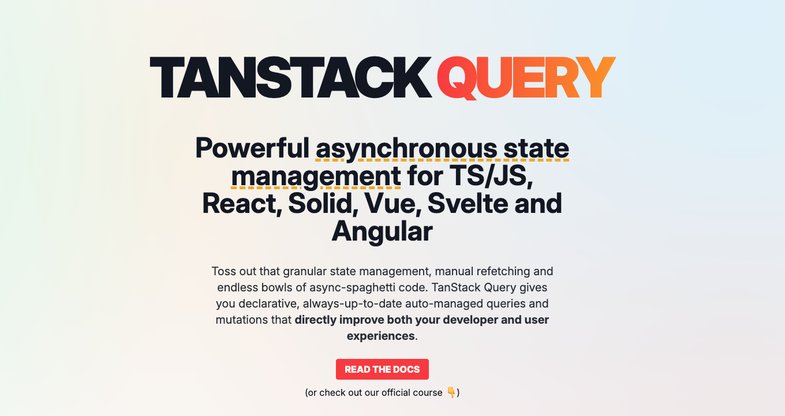

## React Query 기초와 핵심 개념 : 서버 상태관리의 핵심 개념


API 호출, 로딩 상태 관리, 에러 처리, 캐싱 등등... UI 짜기도 바쁜데, 이것들까지 신경쓰느라 머리가 아플 것이다. React 애플리케이션에서 서버 데이터를 관리하는 일은 생각보다 복잡하고 귀찮은 작업이다. 하지만 이제 그런 고민을 할 필요가 없어졌다. 바로 **React Query** 때문이다. 과거엔 React 만을 다뤘기에 React Query란 이름을 썼지만, 지금은 이를 Vue, Svelte, Angular 등으로 확장하면서 현재는 Tanstack-Query 라는 이름을 갖고 있다. 필자는 React Query가 좀 더 직관적이기에 React Query란 단어를 사용할 것이다.

이 글에서는 React Query의 핵심 개념부터 실제 활용법까지 시리즈별로 상세히 다룬다. 서버 상태 관리의 혁명을 일으킨 이 도구를 제대로 이해하고 나면, 당신의 React 개발 경험은 완전히 달라질 것이다.

## 💡급하신 분들을 위해서 결론 먼저!

1. React Query는 서버 상태를 위한 특화된 라이브러리로, 기존 상태 관리와는 접근 방식이 다르다.
2. **Query는 데이터 조회**, **Mutation은 데이터 변경**을 담당하며 **각각 useQuery와 useMutation 훅으로 사용한다.**
3. **쿼리 키는 캐싱과 데이터 식별의 기준**이 되므로 **체계적인 설계가 필수적**이다.
4. **staleTime은 데이터 신선도**, **cacheTime은 ‘상한 데이터’의 캐시 유지 기간**을 결정하는 핵심 개념이다.
5. 자동 리패칭은 데이터를 최신으로 유지해주며 다양한 옵션으로 세밀하게 제어할 수 있다.
6. React Query DevTools는 쿼리 상태를 시각화하여 디버깅과 최적화에 큰 도움을 준다.

## 1. React Query의 개념과 기존 상태 관리와의 차이점

### React Query란 무엇인가?

**React Query**는 React 애플리케이션에서 서버 상태를 가져오고, 캐싱하고, 동기화하고, 업데이트하는 과정을 획기적으로 단순화해주는 라이브러리다. **탠스택(TanStack)**에서 개발한 이 도구는 "서버 상태 관리 라이브러리"라는 새로운 카테고리를 확립했다. 따라서 최근에는 “서버상태 / 유저상태” 이 둘을 나눠서 관리하는 패러다임을 제시했다.

> "(👨🏻‍🏫 : 저는 React Query를 '비동기 상태 관리의 맥가이버 칼처럼 느껴집니다. 데이터 페칭부터 캐싱, 동기화, 업데이트까지 모든 것들을 한 번에 해결해주니까요!)"

### 클라이언트 상태 vs 서버 상태

React Query를 이해하기 위해서는 먼저 **클라이언트 상태**와 **서버 상태**의 차이를 명확히 알아야 한다.

- **클라이언트 상태**: 세션 상태, UI 상태 등 클라이언트에서 완전히 제어되는 로컬 데이터
- **서버 상태**: 서버에 저장되어 있고, 여러 클라이언트가 접근할 수 있으며, 실시간으로 변경될 수 있는 원격 데이터

### 기존 상태 관리와의 차이점

Redux나 Zustand 같은 기존 상태 관리 라이브러리들은 주로 클라이언트 상태 관리에 초점을 맞추고 있었다. 반면, React Query는 서버 상태 관리에 특화되어 있으며 다음과 같은 차별점을 가진다:

1. **자동 캐싱**: 서버에서 가져온 데이터를 **자동으로 캐싱**한다. (어디에 캐싱되는 걸까요? 브라우저? OS? - 이에 대해서도 글로 따로 다뤄보겠다.)
2. **백그라운드 업데이트**: 오래된 데이터는 백그라운드에서 자동으로 업데이트한다.
3. **중복 요청 방지**: 동일한 데이터에 대한 중복 요청을 자동으로 제거한다.
4. **페이지네이션/무한 스크롤**: 복잡한 데이터 패턴을 쉽게 구현할 수 있다.
5. **에러 핸들링**: 네트워크 오류에 대한 자동 재시도 기능을 제공한다.

### 기본 설정

React Query를 사용하기 위한 기본 설정은 다음과 같다:

```jsx
import { QueryClient, QueryClientProvider } from "react-query";

// 클라이언트 생성
const queryClient = new QueryClient();

function App() {
  return (
    // 애플리케이션을 QueryClientProvider로 감싸기
    <QueryClientProvider client={queryClient}>
      <YourApp />
    </QueryClientProvider>
  );
}
```

출처: [React Query 공식 문서](https://tanstack.com/query/latest/docs/react/overview)

---

## 2. Query, Mutation의 기본 개념 이해하기

### Query: 데이터 조회의 기본

**Query**는 서버에서 데이터를 가져오는 작업이다. React Query에서는 `useQuery` 훅을 사용하여 이를 구현한다.

```jsx
import { useQuery } from "react-query";

function Todos() {
  const { isLoading, isError, data, error } = useQuery("todos", fetchTodos);

  if (isLoading) {
    return <span>Loading...</span>;
  }

  if (isError) {
    return <span>Error: {error.message}</span>;
  }

  return (
    <ul>
      {data.map((todo) => (
        <li key={todo.id}>{todo.title}</li>
      ))}
    </ul>
  );
}
```

`useQuery` 훅은 다음과 같은 상태값을 반환한다:

- **isLoading**: 쿼리가 현재 로딩 중인지 여부
- **isError**: 쿼리에 오류가 발생했는지 여부
- **data**: 쿼리로 가져온 데이터
- **error**: 오류가 발생한 경우 해당 오류 객체

> "(👨🏻‍🏫 : useQuery는 마치 냉장고에서 음식을 꺼내는 것과 같답니다. 음식이 있으면 바로 꺼내 쓰고, 없으면 장을 보러 가는 거죠! 매번 useEffect와 useState를 통해서 상태를 지정하고, 패칭 여부에 따라 상태를 바꿔주느라 귀찮았을 겁니다. 그러나, 이 React-Query를 사용한다면 얘기가 달라진다. **isLoading, isError, data, error** 등으로 한번에 여러 상태들을 관리하죠! )"

### Mutation: 데이터 변경의 핵심

**Mutation**은 서버의 데이터를 변경하는 작업이다. 새 데이터 생성, 기존 데이터 수정, 삭제 등의 작업에 사용된다. React Query에서는 `useMutation` 훅을 통해 이를 구현한다.

```jsx
import { useMutation, useQueryClient } from "react-query";

function AddTodo() {
  const queryClient = useQueryClient();

  const mutation = useMutation(
    (newTodo) => {
      return axios.post("/todos", newTodo);
    },
    {
      onSuccess: () => {
        // 성공 시 todos 쿼리 무효화하여 재요청 트리거
        queryClient.invalidateQueries("todos");
      },
    }
  );

  return (
    <form
      onSubmit={(e) => {
        e.preventDefault();
        mutation.mutate({ title: "New Todo" });
      }}
    >
      <button type="submit">Add Todo</button>
    </form>
  );
}
```

`useMutation` 훅은 다음과 같은 상태와 메서드를 제공한다:

- **mutate**: 뮤테이션을 실행하는 함수
- **isLoading**: 뮤테이션이 진행 중인지 여부
- **isError**: 뮤테이션 중 오류가 발생했는지 여부
- **isSuccess**: 뮤테이션이 성공했는지 여부

출처: [React Query Mutations](https://tanstack.com/query/latest/docs/react/guides/mutations)

---

## 3. 쿼리 키(Query Key) 설계 전략과 중요성

### 쿼리 키의 역할

**쿼리 키(Query Key)**는 **React Query에서 가장 중요한 개념 중 하나**다. 이 키는 내부적으로 다음의 같은 역할을 한다:

1. 쿼리 결과를 **고유하게 식별**하는 ID
2. 쿼리 **캐시를 관리**하는 기준
3. **의존성 배열**처럼 작동하여 키가 변경되면 쿼리가 자동으로 다시 실행됨

> "(👨🏻‍🏫 : 쿼리 키는 마치 도서관의 책 분류 번호와 같아요. 정확한 키가 없으면 원하는 데이터를 보관할수도, 다시 그렇게 찾아올 수도 없답니다! 캐시를 위해 해당 라이브러리를 택했는데, 쿼리 키를 잘 모르고 쓰면 안되겠죠?)"

### 효과적인 쿼리 키 설계 전략

### 1. 문자열 키 사용하기

가장 단순한 형태로, 전역적인 데이터를 가져올 때 사용한다.

```jsx
// 모든 할일 목록 가져오기
useQuery("todos", fetchTodos);
```

### 2. 배열 형태의 키 사용하기

더 구체적인 데이터나 매개변수가 필요한 경우 배열 형태를 사용한다.

```jsx
// 특정 ID의 할일 가져오기
useQuery(["todo", 5], () => fetchTodoById(5));

// 필터링된 할일 목록 가져오기
useQuery(["todos", { status: "active" }], () =>
  fetchTodos({ status: "active" })
);
```

### 3. 계층적 구조 만들기

관련 쿼리를 그룹화하여 관리하기 위해 계층적 구조를 사용한다.

```jsx
// 사용자 정보 관련 쿼리
useQuery(["users", userId], () => fetchUser(userId));
useQuery(["users", userId, "posts"], () => fetchUserPosts(userId));
useQuery(["users", userId, "followers"], () => fetchUserFollowers(userId));
```

### 쿼리 키 변경 시 주의사항

쿼리 키가 변경되면 React Query는 이를 완전히 새로운 쿼리로 간주하고 데이터를 다시 가져온다. 따라서 불필요한 요청을 방지하기 위해 키 설계에 주의해야 한다.

```jsx
// 🚫 잘못된 방법: 렌더링마다 새 객체가 생성되어 불필요한 요청 발생
useQuery(["todos", { status: status }], fetchTodos);

// ✅ 올바른 방법: 객체 참조가 유지됨
useQuery(["todos", status], fetchTodos);
```

출처: [React Query Keys](https://tanstack.com/query/latest/docs/react/guides/query-keys)

---

## 4. staleTime vs cacheTime 심층 이해

React Query의 강력한 캐싱 메커니즘을 이해하기 위해서는 **staleTime**과 **cacheTime**의 차이를 명확히 알아야 한다.

### staleTime: 패칭 여부의 결정자

**staleTime**은 데이터가 "신선(fresh)"하다고 간주되는 시간이다. 이 시간 동안은 쿼리가 다시 마운트되어도 **네트워크 요청**이 발생하지 않는다. (요청 자체를 막아주는 것)

- 기본값: **0ms** (모든 데이터는 즉시 "오래됨(stale)"으로 표시됨)
- 설정 방법: `staleTime` 옵션으로 지정

```jsx
useQuery("todos", fetchTodos, {
  staleTime: 60000, // 1분 동안 데이터를 신선하게 유지
});
```

> "(👨🏻‍🏫 : staleTime은 우유의 유통기한과 같아요. 이 기간 내에는 우유가 신선하니 새로 사러 갈 필요가 없죠!)"

### cacheTime: 캐시 수명의 결정자

**cacheTime**은 **비활성 쿼리가 캐시에서 제거되기까지의 시간**이다. **쿼리가 사용되지 않으면(활성 컴포넌트가 없으면)** 이 시간 후에 가비지 컬렉터를 통해 제거된다.

- 기본값: **5분**
- 설정 방법: `cacheTime` 옵션으로 지정

```jsx
useQuery("todos", fetchTodos, {
  cacheTime: 300000, // 5분 동안 캐시 유지
});
```

### staleTime과 cacheTime의 관계

두 개념의 관계를 명확히 이해하기 위한 시나리오를 살펴보자:

1. 쿼리가 실행되어 데이터를 가져옴
2. **staleTime** 동안은 데이터가 "신선"하므로 재요청 없음
3. **staleTime 이후 cacheTime은 안 지났을 때** 데이터는 다음 조건이 성립할 때 재요청됨:
   - 쿼리 인스턴스가 다시 마운트될 때
   - 윈도우가 다시 포커스될 때
   - 네트워크가 다시 연결될 때
   - refetchInterval이 설정된 경우
4. 쿼리가 비활성화되면(사용하는 컴포넌트가 없어지면) **cacheTime** 타이머 시작
5. cacheTime 이후 캐시에서 데이터 제거

```jsx
// 예시: 자주 변경되지 않는 사용자 프로필
useQuery(["user", userId], fetchUserProfile, {
  staleTime: 1000 * 60 * 5, // 5분 동안 신선하게 유지
  cacheTime: 1000 * 60 * 30, // 30분 동안 캐시에 보관
});
```

> "(👨🏻‍🏫 : **staleTime과 cacheTime은 선형적인 게 아녜요!! 둘은 독립적으로 실행됩니다**. 두 타이머는 서로 다른 목적을 가지고 있으며 다른 시점에서 시작됩니다)"

**staleTime**:

- 쿼리가 데이터를 성공적으로 가져온 시점부터 시작됩니다.
- 데이터의 "신선도"를 결정하는 타이머입니다.
- 이 시간 동안은 데이터가 신선하다고 간주되어 재요청이 발생하지 않습니다.


**cacheTime**:

- 쿼리가 비활성화된 시점(해당 쿼리를 사용하는 컴포넌트가 언마운트된 시점)부터 시작됩니다.
- 캐시에 데이터를 얼마나 오래 보관할지 결정하는 타이머입니다.
- 이 시간이 지나면 가비지 컬렉션이 발생하여 캐시에서 데이터가 제거됩니다.

따라서 두 타이머는:

- 시작 시점이 다릅니다 (데이터 페칭 시점 vs 쿼리 비활성화 시점)
- 목적이 다릅니다 (데이터 신선도 vs 캐시 수명)
- 독립적으로 작동합니다 (하나가 다른 하나에 직접적인 영향을 주지 않음)

이 두 개념이 독립적으로 작동하기 때문에 staleTime이 cacheTime보다 길게 설정되는 경우도 있을 수 있지만, 일반적으로는 staleTime ≤ cacheTime으로 설정하는 것이 일반적입니다.


출처: [React Query Important Defaults](https://tanstack.com/query/latest/docs/react/guides/important-defaults)

---

## 5. 자동 리패칭(refetching) 메커니즘과 제어 방법

React Query의 강력한 기능 중 하나는 **자동 리패칭(refetching)** 메커니즘이다. 이는 데이터를 최신 상태로 유지하는 데 큰 도움이 된다.

### 자동 리패칭이 발생하는 상황

기본적으로 React Query는 다음 상황에서 자동으로 데이터를 다시 가져온다:

1. **쿼리 마운트 시**: 새로운 쿼리 인스턴스가 마운트될 때
2. **윈도우 포커스 시**: 사용자가 다른 탭에서 돌아올 때 (`refetchOnWindowFocus`)
3. **네트워크 재연결 시**: 네트워크 연결이 복구될 때 (`refetchOnReconnect`)
4. **설정된 간격마다**: 주기적인 폴링이 필요할 때 (`refetchInterval`)

> "(👨🏻‍🏫 : 자동 리패칭은 마치 **스마트 냉장고가 식품이 떨어지면, 해당 식료품을 자동으로 주문**해주는 것과 같아요. 편리하지만, 때로는 우리가 직접 제어하고 싶을 때도 있죠!)"

### 리패칭 동작 제어하기

각 리패칭 동작은 쿼리 옵션을 통해 세밀하게 제어할 수 있다.

```jsx
useQuery("todos", fetchTodos, {
  // 윈도우 포커스 시 리패칭 비활성화
  refetchOnWindowFocus: false,

  // 네트워크 재연결 시 리패칭 비활성화
  refetchOnReconnect: false,

  // 마운트 시 리패칭 비활성화
  refetchOnMount: false,

  // 5초마다 자동으로 리패칭
  refetchInterval: 5000,

  // 창이 포커스된 상태에서만 refetchInterval 활성화
  refetchIntervalInBackground: false,

  // 최대 3번까지 실패 시 재시도
  retry: 3,

  // 재시도 간격을 지수적으로 증가시킴 (1초, 2초, 4초)
  retryDelay: (attemptIndex) => Math.min(1000 * 2 ** attemptIndex, 30000),
});
```

### 수동 리패칭 트리거하기

자동 리패칭 외에도 필요에 따라 수동으로 리패칭을 트리거할 수 있다.

```jsx
function Todos() {
  const { data, refetch, isLoading } = useQuery("todos", fetchTodos, {
    enabled: false, // 자동 실행 비활성화
  });

  return (
    <div>
      <button onClick={() => refetch()}>수동으로 데이터 가져오기</button>
      {isLoading ? (
        <span>Loading...</span>
      ) : (
        <ul>
          {data.map((todo) => (
            <li key={todo.id}>{todo.title}</li>
          ))}
        </ul>
      )}
    </div>
  );
}
```

### 조건부 리패칭

특정 조건에서만 쿼리를 실행하고 싶을 때는 `enabled` 옵션을 사용한다.

```jsx
// userId가 있을 때만 쿼리 실행
const { data, isIdle } = useQuery(["user", userId], () => fetchUser(userId), {
  enabled: !!userId, // userId가 존재할 때만 쿼리 활성화
});

// isIdle은 쿼리가 비활성화되어 실행되지 않았을 때 true
if (isIdle) {
  return <span>사용자 ID를 입력해주세요</span>;
}
```

출처: [React Query Refetching](https://tanstack.com/query/latest/docs/react/guides/query-functions)

---

## 6. React Query DevTools 활용하기

React Query의 강력한 기능 중 하나는 내장된 개발자 도구다. **React Query DevTools**는 애플리케이션의 모든 쿼리 상태를 시각적으로 보여주어 디버깅과 최적화에 큰 도움을 준다.

### DevTools 설치 및 설정

먼저 개발자 도구를 설치해야 한다:

```bash
# npm
npm install @tanstack/react-query-devtools

# yarn
yarn add @tanstack/react-query-devtools

```

그런 다음 애플리케이션에 DevTools를 추가한다:

```jsx
import { QueryClient, QueryClientProvider } from "react-query";
import { ReactQueryDevtools } from "@tanstack/react-query-devtools";

const queryClient = new QueryClient();

function App() {
  return (
    <QueryClientProvider client={queryClient}>
      {/* 애플리케이션 컴포넌트 */}
      <YourApp />

      {/* 개발자 도구 - 개발 환경에서만 렌더링 */}
      {process.env.NODE_ENV === "development" && (
        <ReactQueryDevtools initialIsOpen={false} position="bottom-right" />
      )}
    </QueryClientProvider>
  );
}
```

> "(👨🏻‍🏫 : DevTools는 마치 자동차의 대시보드 같아요. 엔진(쿼리) 상태를 한눈에 볼 수 있어 문제가 생겼을 때 빠르게 대응할 수 있답니다!)"

그러고 나면 아래의 사진같이 야자수 아이콘이 생긴다.


이를 클릭할 시에는 다음과 같이 DevTool이 올라오게 되며, 어떤 쿼리가 실행되는지 얼마나 신선(stale)한지, 어떤 상태인지 등에 대해서 확인해볼 수 있게 되어있다.


### DevTools 주요 기능

### 1. 쿼리 상태 모니터링

모든 쿼리의 상태(fresh, stale, fetching, paused, inactive)를 실시간으로 확인할 수 있다.

### 2. 쿼리 데이터 탐색

각 쿼리의 데이터, 쿼리 키, 마지막 업데이트 시간 등을 확인할 수 있다.

### 3. 수동 리패칭 및 무효화

UI를 통해 특정 쿼리를 수동으로 리패치하거나 무효화할 수 있다.

### 4. 쿼리 타임라인

쿼리 실행 타임라인을 시각적으로 확인하여 성능 병목을 식별할 수 있다.

### DevTools 활용 팁

1. **개발 중에만 활성화**: 프로덕션 빌드에는 DevTools를 포함하지 않도록 한다.
2. **필터링 활용**: 많은 쿼리가 있을 때 필터링을 통해 특정 쿼리만 확인한다.
3. **쿼리 그룹화**: 쿼리 키를 체계적으로 설계하여 관련 쿼리를 그룹화한다.
4. **성능 최적화**: 불필요한 리패칭이나 중복 쿼리를 식별하여 최적화한다.

```jsx
// 예: 개발 환경에서만 DevTools 동적 임포트
import { QueryClientProvider, QueryClient } from "react-query";
import { lazy, Suspense } from "react";

const ReactQueryDevtools =
  process.env.NODE_ENV === "development"
    ? lazy(() =>
        import("@tanstack/react-query-devtools").then((mod) => ({
          default: mod.ReactQueryDevtools,
        }))
      )
    : () => null;

function App() {
  const queryClient = new QueryClient();

  return (
    <QueryClientProvider client={queryClient}>
      <YourApp />
      <Suspense fallback={null}>
        <ReactQueryDevtools initialIsOpen={false} />
      </Suspense>
    </QueryClientProvider>
  );
}
```

출처: [React Query DevTools](https://tanstack.com/query/latest/docs/react/devtools)

---

# 실전 활용 예제: 할 일 관리 애플리케이션

지금까지 배운 개념을 종합하여 간단한 할 일 관리 애플리케이션을 구현해보자.

```jsx
import {
  QueryClient,
  QueryClientProvider,
  useQuery,
  useMutation,
} from "react-query";
import { ReactQueryDevtools } from "@tanstack/react-query-devtools";
import axios from "axios";
import { useState } from "react";

// API 함수
const fetchTodos = () => axios.get("/api/todos").then((res) => res.data);
const addTodo = (todo) =>
  axios.post("/api/todos", todo).then((res) => res.data);
const updateTodo = (todo) =>
  axios.put(`/api/todos/${todo.id}`, todo).then((res) => res.data);
const deleteTodo = (id) =>
  axios.delete(`/api/todos/${id}`).then((res) => res.data);

// 쿼리 클라이언트 생성
const queryClient = new QueryClient({
  defaultOptions: {
    queries: {
      staleTime: 1000 * 60, // 1분
      cacheTime: 1000 * 60 * 5, // 5분
      retry: 1,
      refetchOnWindowFocus: true,
    },
  },
});

function TodoApp() {
  return (
    <QueryClientProvider client={queryClient}>
      <TodoList />
      <ReactQueryDevtools initialIsOpen={false} />
    </QueryClientProvider>
  );
}

function TodoList() {
  const [newTodo, setNewTodo] = useState("");

  // 할 일 목록 쿼리
  const {
    data: todos,
    isLoading,
    isError,
    error,
  } = useQuery("todos", fetchTodos, {
    onSuccess: (data) => {
      console.log("할 일 목록을 성공적으로 가져왔습니다:", data);
    },
    onError: (error) => {
      console.error("할 일 목록을 가져오는데 실패했습니다:", error);
    },
  });

  // 할 일 추가 뮤테이션
  const addMutation = useMutation(addTodo, {
    onSuccess: () => {
      // 성공 시 todos 쿼리 무효화
      queryClient.invalidateQueries("todos");
      setNewTodo("");
    },
  });

  // 할 일 토글 뮤테이션
  const toggleMutation = useMutation(updateTodo, {
    onSuccess: () => {
      queryClient.invalidateQueries("todos");
    },
  });

  // 할 일 삭제 뮤테이션
  const deleteMutation = useMutation(deleteTodo, {
    onSuccess: () => {
      queryClient.invalidateQueries("todos");
    },
  });

  if (isLoading) return <div>로딩 중...</div>;
  if (isError) return <div>에러: {error.message}</div>;

  return (
    <div>
      <h1>할 일 목록</h1>

      <form
        onSubmit={(e) => {
          e.preventDefault();
          addMutation.mutate({ title: newTodo, completed: false });
        }}
      >
        <input
          type="text"
          value={newTodo}
          onChange={(e) => setNewTodo(e.target.value)}
          placeholder="새 할 일 추가"
        />
        <button type="submit" disabled={addMutation.isLoading}>
          {addMutation.isLoading ? "추가 중..." : "추가"}
        </button>
      </form>

      <ul>
        {todos.map((todo) => (
          <li
            key={todo.id}
            style={{ textDecoration: todo.completed ? "line-through" : "none" }}
          >
            <input
              type="checkbox"
              checked={todo.completed}
              onChange={() =>
                toggleMutation.mutate({
                  ...todo,
                  completed: !todo.completed,
                })
              }
            />
            {todo.title}
            <button onClick={() => deleteMutation.mutate(todo.id)}>삭제</button>
          </li>
        ))}
      </ul>
    </div>
  );
}
```

출처: [React Query 예제](https://tanstack.com/query/latest/docs/react/examples/basic)

> 🙇🏻 글 내에 틀린 점, 오탈자, 비판, 공감 등 모두 적어주셔도 됩니다. 감사합니다..! 🙇🏻
