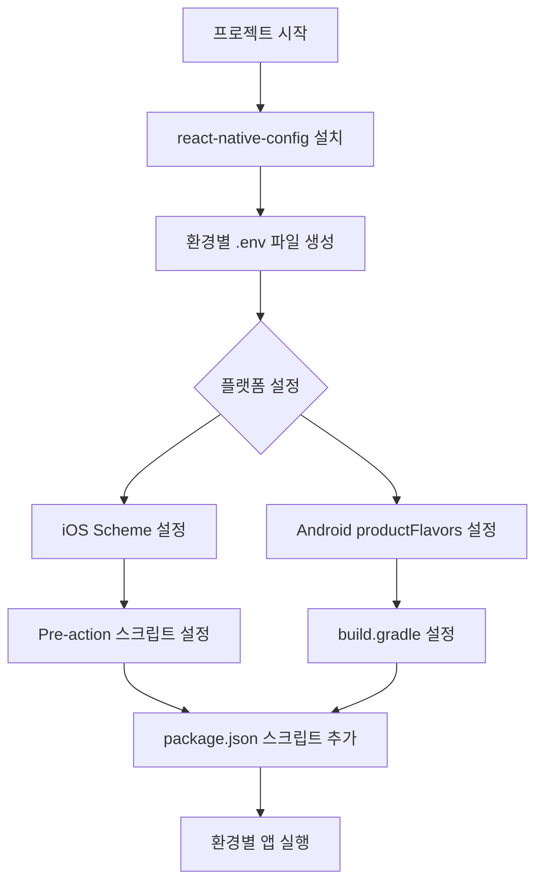

# React Native에서 환경(dev, production, staging)별로 개발 환경 세팅하기

모바일 앱 개발을 하다 보면 개발 환경, 테스트 환경, 운영 환경 등 다양한 환경에서 앱을 실행해야 할 때가 있다. 각 환경마다 API 서버 주소나 API 키 등이 다른 경우가 많은데, 이를 매번 수동으로 변경하는 것은 번거롭고 실수의 여지가 많다.

> (👨🏻‍🏫 : 저도 처음에는 환경 변수 파일을 매번 수동으로 바꿔주다가 실수로 개발 서버 API 키를 운영 환경에 배포한 적이 있답니다... ~~ㅎㅎ 배포는 했으나 아무도 사용하지 않아서 다행이지만 (😢?)~~ 그래서 이 방법을 찾게 되었죠!)

이 글에서는 React Native에서 환경 변수를 효율적으로 관리하는 방법에 대해 알아보겠다. **react-native-config** 라이브러리를 사용하여 iOS와 Android 모두에서 환경별로 다른 설정을 적용하는 방법을 단계별로 설명한다.

## 1. 환경 별로 환경 변수를 설정해야 하는 이유

### 환경 분리의 필요성

개발, 스테이징, 프로덕션 환경을 분리하는 것은 소프트웨어 개발 과정에서 매우 중요하다. 각 환경은 서로 다른 목적을 가지고 있다:

- **개발 환경(dev)**: 개발자들이 새로운 기능을 구현하고 테스트하는 공간으로, 안정성보다는 빠른 반복 작업이 중요하다
- **스테이징 환경(staging)**: 프로덕션과 유사한 환경에서 QA 테스트와 사용자 수용 테스트를 진행하는 공간
- **프로덕션 환경(production)**: 실제 사용자들이 접근하는 환경으로 안정성, 보안, 성능이 가장 중요하다

### 환경 변수 분리의 장점

환경 변수를 분리함으로써 얻을 수 있는 주요 이점은 다음과 같다:

- **보안 강화**: 민감한 API 키나 비밀번호를 소스 코드에 하드코딩하지 않고 외부에서 관리할 수 있다
- **유지보수 용이성**: 코드 변경 없이 환경 설정만 변경하여 다른 환경에서 앱을 실행할 수 있다
- **예측 가능성**: 애플리케이션의 동작을 예측 가능하게 만들어 개발 과정의 안정성을 높인다
- **관심사 분리**: 설계 원칙에 따라 애플리케이션 구성을 코드와 분리하여 효율적으로 관리할 수 있다

> (👨🏻‍🏫 : 무엇보다도, 배포 사이클이 긴 앱의 특성상, App Store, Play Store 에서 앱을 바꾸려고 한다면 심사 기간이 있답니다. 한 번 스토어에 올리기 전에 꼭 여러 단계별로 환경을 세팅해보고 올려보는 작업이 중요합니다.)

## 2. iOS 환경 (Xcode)에서 Scheme의 역할

### Scheme이란?

Xcode에서 **Scheme**은 앱을 빌드, 실행, 테스트, 프로파일링, 아카이브하는 방법을 정의한다. 기본적으로 프로젝트를 생성하면 하나의 Scheme이 생성되지만, 여러 환경에 대응하기 위해 여러 Scheme을 만들 수 있다.

> (👨🏻‍🏫 : Scheme은 쉽게 말해 앱을 어떤 설정으로 실행할지 정해주는 프로필이라고 생각하시면 됩니다!)

### Scheme의 주요 기능

- 빌드 설정 (Debug/Release)
- 실행 환경 설정
- 테스트 설정
- 프로파일링 설정
- 아카이브 설정

Scheme을 활용하면 개발 환경, 테스트 환경, 운영 환경 등 다양한 환경에서 앱을 쉽게 전환하여 실행할 수 있다.

## 3. 안드로이드 환경에서의 .env 통합하기

### Android의 productFlavors

Android에서는 **productFlavors**를 사용하여 다양한 빌드 변형을 만들 수 있다. 이를 통해 개발, 테스트, 운영 환경 등 다양한 환경에 대응할 수 있다.

### build.gradle 설정하기

안드로이드에서 환경 변수를 설정하기 위해 `android/app/build.gradle` 파일을 수정해야 한다.

```
// android/app/build.gradle
apply plugin: "com.android.application"
apply from: project(':react-native-config').projectDir.getPath() + "/dotenv.gradle"

android {
    // ...
    defaultConfig {
        // ...
        resValue "string", "build_config_package", "com.yourappname"
    }

    flavorDimensions "version"
    productFlavors {
        development {
            dimension "version"
            applicationIdSuffix ".dev"
            resValue "string", "app_name", "YourApp Dev"
        }

        production {
            dimension "version"
            resValue "string", "app_name", "YourApp"
        }
    }
}
```

## 환경 변수 파일 설정

`android/app/build.gradle` 파일에 다음과 같이 환경 변수 파일을 설정한다.

```
project.ext.envConfigFiles = [
    developmentDebug: ".env.development",
    developmentRelease: ".env.development",
    productionDebug: ".env.production",
    productionRelease: ".env.production",
]
```

> (👨🏻‍🏫 : 안드로이드에서는 이렇게 각 빌드 타입과 환경에 맞는 .env 파일을 지정해줘야 합니다!)

## 4. Xcode에서 Scheme 설정을 통해서 .env 파일로 통합하기

### 1) 새로운 Scheme 생성하기

Xcode에서 새로운 Scheme을 생성하는 방법은 다음과 같다:

1. Xcode 메뉴에서 `Product > Scheme > Manage Schemes...`를 선택한다.
2. 좌측 하단의 "+" 버튼을 클릭하여 새 Scheme을 생성한다.
3. 이름을 "Development"나 "Production" 등으로 설정한다.

### 2) Pre-action 스크립트 설정하기

각 Scheme에 대해 빌드 전에 실행될 스크립트를 설정하여 적절한 .env 파일을 복사하도록 한다:

1. Scheme을 선택하고 `Edit Scheme...`을 클릭한다.
2. 왼쪽 메뉴에서 `Build`를 선택하고 `Pre-actions`를 클릭한다.
3. "+" 버튼을 클릭하고 `New Run Script Action`을 선택한다.
4. 다음 스크립트를 입력한다:

```bash
# Development Scheme용 스크립트
cp "${PROJECT_DIR}/../env/.env.development" "${PROJECT_DIR}/../.env"
"${SRCROOT}/../node_modules/react-native-config/ios/ReactNativeConfig/BuildXCConfig.rb"
```

> (👨🏻‍🏫 : 이 스크립트는 빌드가 시작되기 전에 해당 환경의 .env 파일을 프로젝트 루트의 .env 파일로 복사합니다! 즉 각 환경(dev, staging, production) 별로 API 엔드포인트가 다르기에 각각 .env를 제작하고서 이를 하나의 .env로 통합 후 빌드를 하는 것이죠)

### 3) Config 파일 설정

Xcode 프로젝트에서 Config 파일을 설정해야 한다:

1. Xcode에서 프로젝트를 연다 (`xed ./ios` 명령어 사용).
2. Config 파일로 이동하여 다음 코드를 추가한다:

   `text#include? "tmp.xcconfig"`

3. Debug와 Release 모두 Config 설정을 해준다.

## 5. 다른 방식으로 구현하기

### react-native-dotenv 사용하기

**react-native-config** 외에도 **react-native-dotenv**를 사용하여 환경 변수를 관리할 수 있다.

```bash
# 설치
npm install react-native-dotenv
# 또는
yarn add react-native-dotenv
```

babel.config.js 파일에 다음과 같이 설정한다:

```jsx
module.exports = {
  presets: ["module:metro-react-native-babel-preset"],
  plugins: [
    [
      "module:react-native-dotenv",
      {
        moduleName: "react-native-dotenv",
        path: ".env",
        blacklist: null,
        whitelist: null,
        safe: false,
        allowUndefined: true,
      },
    ],
  ],
};
```

> (👨🏻‍🏫 : react-native-dotenv는 설정이 더 간단하지만, iOS와 Android에서 환경별로 다른 .env 파일을 사용하는 기능이 react-native-config보다 제한적입니다!)

### 클라우드 기반 환경 변수 관리

보안이 중요한 키의 경우, 클라우드 서비스를 통해 환경 변수를 관리하는 방법도 있다. AWS Lambda나 Firebase Functions 등을 사용하여 중요 키를 서버에서 관리하고 앱에서는 API 호출을 통해 가져오는 방식이다.

```jsx
// 예시: 클라우드에서 환경 변수 가져오기
const fetchConfig = async () => {
  try {
    const response = await fetch("https://your-api.com/config");
    const config = await response.json();
    return config;
  } catch (error) {
    console.error("Failed to fetch config:", error);
    return defaultConfig;
  }
};
```

## 6. 프로세스 시각화

환경 변수 설정 프로세스를 시각화하면 다음과 같다:



이 다이어그램은 환경 변수 설정의 전체 흐름을 보여준다. 각 단계를 따라가면 환경별로 다른 설정을 적용할 수 있다.

## 7. yarn script를 통해서 이를 최적화 하기

### package.json에 스크립트 추가하기

환경별로 앱을 쉽게 실행할 수 있도록 package.json에 스크립트를 추가한다:

```json
"scripts": {
  "ios:dev": "react-native run-ios --scheme Development",
  "ios:prod": "react-native run-ios --scheme Production",
  "android:dev": "react-native run-android --variant=developmentDebug",
  "android:prod": "react-native run-android --variant=productionDebug",
  "start:dev": "ENVFILE=.env.development react-native start",
  "start:prod": "ENVFILE=.env.production react-native start"
}
```

이렇게 설정하면 터미널에서 간단한 명령어로 원하는 환경에서 앱을 실행할 수 있다:

```bash
# iOS 개발 환경
yarn ios:dev

# iOS 운영 환경
yarn ios:prod

# Android 개발 환경
yarn android:dev

# Android 운영 환경
yarn android:prod
```

> (👨🏻‍🏫 : 이렇게 스크립트를 설정해두면 팀원들도 쉽게 환경을 전환할 수 있어요! 특히 신입 개발자분들에게 큰 도움이 됩니다! + 저는 yarn 을 사용하는데 npm을 쓰신다면, npm 명령어로 해야겠죠?)

## 8. 결론

React Native에서 환경 변수를 관리하는 것은 개발 프로세스를 효율적으로 만드는 중요한 부분이다. **react-native-config**나 **react-native-dotenv** 같은 라이브러리를 사용하면 다양한 환경에서 앱을 쉽게 전환하여 실행할 수 있다.

iOS에서는 **Scheme**을, Android에서는 **productFlavors**를 활용하여 환경별 설정을 관리할 수 있다. 이를 통해 개발자는 코드 변경 없이 다양한 환경에서 앱을 테스트하고 배포할 수 있다.

또한, package.json에 스크립트를 추가하여 명령어 한 줄로 원하는 환경에서 앱을 실행할 수 있도록 최적화할 수 있다.

환경 변수 관리는 개발 생산성을 높이고 실수를 줄이는 데 큰 도움이 된다. 특히 팀 단위로 개발할 때 더욱 중요하다.

> 🙇🏻 글 내에 틀린 점, 오탈자, 비판, 공감 등 모두 적어주셔도 됩니다. 감사합니다..! 🙇🏻
